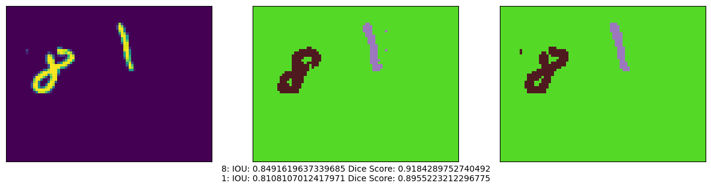

# HandwrittenImageSegmentation

Project completed as a part of a programming assignment of the self-enrolled Coursera course of [Advanced Computer Vision with TensorFlow](https://www.coursera.org/learn/advanced-computer-vision-with-tensorflow).

Course completion certificate [here](https://www.coursera.org/account/accomplishments/verify/UNK5EAW3NGHC).

